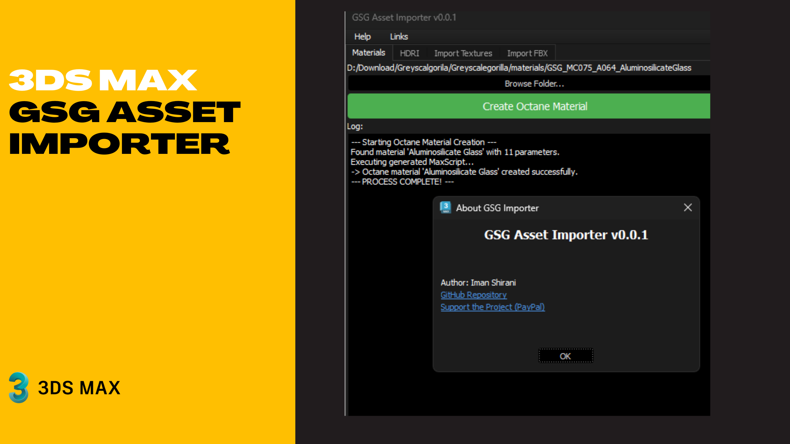

# GSG Asset Importer for 3ds Max (Unofficial, Octane Only, Open Beta) 🎨


A **3ds Max tool** to easily import [Greyscalegorilla](https://greyscalegorilla.com/) assets for the **Octane Renderer**.  
Supports materials, HDRI environments, textures, and FBX models — all streamlined into one clean UI.


[](https://www.paypal.com/donate/?hosted_button_id=LAMNRY6DDWDC4)

---



---

## 📖 About the Project

The **GSG Asset Importer** was created to make working with  
[Greyscalegorilla](https://greyscalegorilla.com/) assets inside **3ds Max + Octane Renderer** faster and easier.  

Instead of manually setting up each texture, HDRI, or FBX, this tool automates the process, saving time for motion designers, 3D artists, and anyone using Octane in their daily workflow.

### Why this project?
- ⚡ Speed up look-development with instant Octane materials.  
- 🖥 No more manual shader or node setup — everything is auto-connected.  
- 🌍 Easy HDRI loading for realistic lighting.  
- 🛠 Designed to be lightweight, clean, and extendable.  

This is an **unofficial tool** (not affiliated with Greyscalegorilla or OTOY) created by [Iman Shirani](https://github.com/imanshirani) for the 3D community.  

---

## ✨ Features

- 🧱 **Material Importer**  
  Import and auto-build Octane materials from GSG asset folders (`.gsgm`, textures, maps).

- 🌌 **HDRI Environment Loader**  
  Create and set up HDRI environments (`.hdr`, `.exr`) directly into Octane.

- 🖼 **Texture Importer**  
  Load multiple textures as Octane texture nodes into the Slate Material Editor.

- 📦 **FBX Importer**  
  Batch import FBX models from a folder into 3ds Max.

- 📋 **UI Goodies**  
  - Modern Qt-based UI  
  - Tabs for each workflow  
  - Log box for process feedback  
  - Help/About dialog with links  

---

## 🚀 Installation

1. Clone or download this repository.
   ```bash
   git clone https://github.com/imanshirani/GSG-Asset-Importer.git
2. Place GSG Asset Importer.py in your 3ds Max scripts/ or plugins/ folder.
3. In 3ds Max, run the script via Scripting > Run Script…

---

🛠 Usage

1. Open the GSG Asset Importer window inside 3ds Max.
2. Choose the desired tab:
  - Materials → Browse to a GSG material folder and build Octane materials.
  - HDRI → Load .hdr or .exr files as Octane environments.
  - Import Textures → Batch load textures as nodes.
  - Import FBX → Import all .fbx models from a folder.
3. Enjoy faster, cleaner workflows with Octane + GSG!

---

📌 Requirements

  - 3ds Max (tested on 2025+)
  - Octane Renderer as the active renderer
  - Greyscalegorilla Assets

🤝 Contributing

Pull requests, issues, and feature requests are welcome!

Please open an issue to discuss major changes before submitting PRs.


📜 License

This project is licensed under the MIT License
.
© 2025 Iman Shirani
